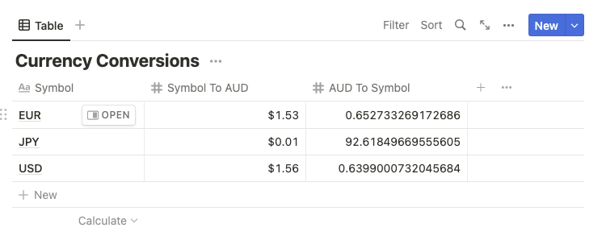

# Notion Currency Converter Table

A small TypeScript script for populating a given database in your Notion with some currency conversion information (to/from AUD). 

## Quick Start
1. Follow Notion's '[Getting Started](https://developers.notion.com/docs/getting-started#getting-started)' guide and create a new integration in your Notion account
2. Create an [Open Exchange Rates](https://openexchangerates.org/account) account
3. Create a database page in Notion and [share it with you integration](https://developers.notion.com/docs/getting-started#getting-started)  
4. Create a `.env` file in the root dir that follows the structure of `.env.template`
5. `yarn install && yarn start`

### Note

Your table must have the same columns and column types as this in order for the script to work:



Additionally, all currencies are only converted to/from AUD.

## Environment Variables (.env)

```
# Notion's 'Internal Integration Token' created when you create your integration
NOTION_KEY=

# ID of Notion database page, retrieved from database URL
NOTION_DB_ID=

# Open Exchange Rates App ID
OPEN_EXR_APP_ID=
```
